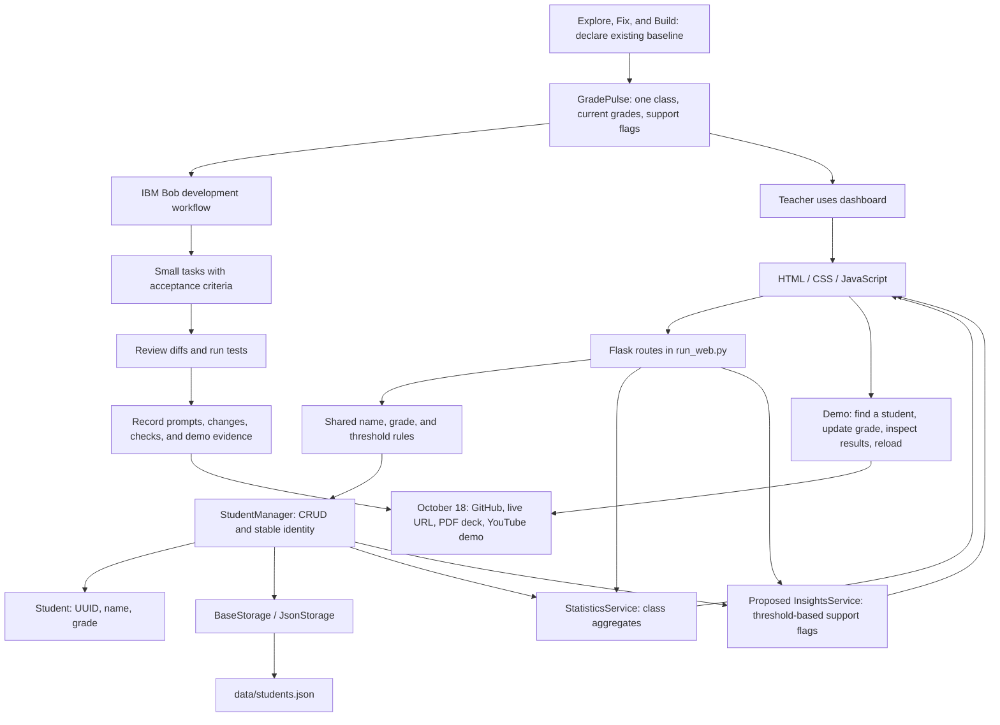

# IBM Bob hackathon: repository plan and unified schema

Prepared October 7, 2026. Repository: `C:\Users\ferre\Desktop\College\Coding\IBM BOB\student-grade-system`.

## Confirmed event context

You joined **Building with IBM Bob** and selected this folder as your repository. Event facts below were checked against the [official event page](https://hackathon.angelhack.com/web/events/building-with-ibm-bob) on October 7, 2026.

The virtual event runs September 28–October 18. Submission closes **October 18, 2026, 11:59 p.m. EDT**; winners are announced October 28. Eligibility is US residents aged 18+, with teams of 1–5. Each person joins one team; each team submits one project. Existing projects are allowed, with evaluation focused on declared improvements during the event.

Judging weights: Bob adoption 30%, relevant innovation 30%, technical execution 30%, presentation 10%. Total cash prizes are $2,000, split between two tracks. Participants receive event Bob Pro+ access; optional SkillsBuild learning is not required.

Required submission: accessible GitHub repository with code, README, deployment files and test instructions; description of at most 100 words; track and stack; improvement summary; PDF pitch deck; YouTube demo of at most three minutes; live application URL. [Official submission requirements](https://hackathon.angelhack.com/web/events/building-with-ibm-bob).

Recommendation: **Students / Early Career — Explore, Fix, and Build**, which emphasizes understanding an unfamiliar app, fixing an issue, and adding a feature. The other track is **Experienced Developers — Modernize What Matters**. [IBM track descriptions](https://developer.ibm.com/events/building-with-ibm-bob-angelhack-x-ibm-virtual-hackathon/).

The separate [detailed rules link](https://go.angelhack.com/ibmbob-hackrules) was inaccessible to the browsing tool; the public event page was verified. Your selected track, team membership, access redemption, and repository origin remain personal details to confirm. If you authored this app and already know it well, clarify the unfamiliar-app aspect with the organizer. Runtime AI is not listed as a submission requirement on the event page.

## Proposed project: GradePulse

**Pitch:** A teacher can maintain a class roster, see class performance, and quickly find students whose current grade falls below the passing threshold.

**User:** A teacher reviewing one class. **Problem:** A basic grade list requires manual work to find students who need attention. **Outcome:** One dashboard connects accurate grades, class statistics, and explainable support flags.

Keep the existing Python, Flask, HTML, CSS, and JavaScript stack. Use synthetic student records for the demo. One grade per student supports a current performance snapshot; it cannot establish trends, predict future failure, or identify the reasons for a student's grade.

## Repository baseline

| Area | Existing implementation | Role in the plan |
|---|---|---|
| Web entry | `run_web.py` | Flask routes and dashboard |
| Console entry | `main.py`, `app/ui/` | Preserve the existing console workflow |
| Model | `app/models/student.py` | Name, grade, stable UUID, serialization |
| Validation | `app/validators/input_validator.py`, `app/config.py` | Shared input rules and thresholds |
| Services | `app/services/student_manager.py`, `statistics_service.py` | CRUD, search, sorting, aggregates |
| Storage | `app/storage/base_storage.py`, `json_storage.py` | Injected storage with atomic JSON replacement |
| Presentation | `app/templates/index.html`, `app/static/` | Dashboard, forms, table, statistics |
| Verification | `tests/` | Existing model, service, storage, validation tests |

Baseline verification: `python -m unittest discover -s tests -q` passed **76 tests** on October 7, 2026. This does not verify browser interaction or all Flask API failure paths. Several source files and the data file already have uncommitted edits; review and preserve that work before starting new changes.

## Unified schema

This combines the event gate, implementation flow, data contracts, and submission evidence. Solid arrows describe the application; the Bob branch describes the development workflow. The insights service and support panel are proposed additions.



### Data contracts

| Contract | Fields | Rules |
|---|---|---|
| Stored student, existing | `id`, `name`, `grade` | Stable UUID; nonempty name; grade 0–100. Current model stores integers. |
| API student, existing | `student_id`, `id`, `index`, `name`, `grade` | `student_id` is the stable identity. `id` is a positional display label such as STU-001; it can change after sorting or deletion. |
| Statistics, existing | `total_students`, `average`, `highest`, `lowest`, `passing_count`, `failing_count`, `passing_rate` | Derived from the roster; current passing threshold is 60. |
| Support flag, proposed | `student_id`, `grade`, `threshold`, `status`, `reason` | Derived, not separately stored. Example reason: "Current grade 54 is below passing threshold 60." |
| Bob work-log entry, proposed | task, prompt, files changed, reviewed behavior, verification, evidence link | Record actual work; do not claim Bob authored earlier code without evidence. |

Example proposed support response:

```json
{
  "student_id": "example-stable-uuid",
  "grade": 54,
  "threshold": 60,
  "status": "needs_attention",
  "reason": "Current grade 54 is below passing threshold 60."
}
```

## Execution plan using IBM Bob

Work through these stages in order. Allocate roughly 10% of available time to requirements and baseline, 30% to correctness, 30% to the support feature, 15% to demo polish, and 15% to submission. These are planning allocations; no event duration is assumed.

| Stage | Work to ask Bob to do | Completion criterion |
|---|---|---|
| 0. Record baseline | Confirm selected track; review the existing diff and run baseline tests; separate earlier work from event improvements | Existing work understood and Bob contribution recorded accurately |
| 1. Make grades trustworthy | Centralize thresholds; align frontend labels and statistics; choose integer-only validation or preserved decimals; reject booleans and non-finite numbers; validate JSON payload shapes | Same grade has consistent meaning everywhere; malformed input returns a clear client error |
| 2. Make persistence trustworthy | Check save results before reporting success; define rollback behavior on failed writes; preserve UUIDs through sort, delete, and reload | Failed writes cannot appear as a successful durable update; stale IDs return 404 |
| 3. Add the main feature | Add `app/services/insights_service.py`, a read-only `/api/insights` route, and a support panel with threshold-based reasons | Teacher can identify below-threshold students and see flags update after a grade change |
| 4. Polish the demo | Improve empty/error states, mobile layout, safe text rendering, keyboard use, and clear grade terminology | Full demo works on desktop and a narrow screen with synthetic data |
| 5. Prepare submission | Update README; deploy and test the live app; prepare Bob-use evidence, PDF deck, YouTube video, and submission fields | A reviewer can run the project and understand both its value and Bob's contribution |

### Calendar for the remaining work

These are proposed milestones, not organizer deadlines. All dates are in your America/New_York timezone.

| Date | Your milestone |
|---|---|
| October 7 | Open this repository in Bob, confirm track and access, capture baseline and existing diff |
| October 8–9 | Fix grade policy, validation, persistence responses, and focused regression tests |
| October 10–12 | Build and verify the support panel through Bob |
| October 13–14 | Polish browser workflow, update README, select hosting and deploy |
| October 15–16 | Verify live persistence; prepare deck, description, improvement log and video |
| October 17 | Rehearse and review all submission links; aim to submit early |
| October 18 | Buffer for final fixes and submission before 11:59 p.m. EDT |

For hosting, have Bob compare the provider's writable storage and process model before deployment. A local JSON file may disappear on an ephemeral host or diverge across workers. Prefer one application process with a persistent volume for a small demo, or migrate through BaseStorage to a persistent database if the chosen host needs it.

### Proposed submission folder

Create these through Bob as the work is completed; they are planned artifacts, not files already generated:

```text
submission/
  project-description.md     # <=100 words, track, stack, demo/video URLs
  improvements.md            # baseline versus changes made in the event
  bob-work-log.md            # dated prompts, decisions, diffs, verification
  pitch-deck.pdf             # problem, demo, architecture, Bob use, roadmap
  evidence/                 # screenshots and actual test/demo evidence
```

Suggested deck: problem and team; original app; bugs diagnosed with Bob; useful new feature; architecture and verification; Bob contribution and next steps. Tie each claim to an actual change or recorded result. Keep this planning assistance separate from work actually performed with Bob.

Specific implementation concerns visible in the current source:

- The frontend calls grades 50–59 "Below Avg" while statistics count grades below 60 as failing. Configuration and frontend grade bands also differ. Agree on one shared policy.
- The model casts numeric grades to integers, so 89.9 becomes 89. Decide the contract explicitly and apply it in the model, validator, API, and UI.
- Numeric validation accepts booleans as numbers and does not explicitly reject non-finite floats. Include boundary and malformed input cases.
- Add, update, delete, and sort routes call `manager.save()` without checking its return value. Atomic file replacement protects the file but does not make the API's success response reliable or roll back memory.
- Names appear inside inline JavaScript handlers and toast HTML. Use event listeners and text nodes so quotes and markup cannot break behavior or inject content.
- JSON storage and the global in-memory manager suit a local, single-process demo. Multiple server workers can hold different rosters; choose SQLite and an appropriate request lifecycle if deployment requires concurrent use.

### Copy-ready first prompt for Bob

> Work in this student-grade-system repository. First inspect README.md, run_web.py, app/models, app/services, app/storage, app/validators, app/templates, app/static, and tests. Review the existing uncommitted changes and preserve them. We are planning GradePulse: a teacher dashboard for class performance and explainable below-threshold support flags. Read HACKATHON_PLAN.md as planning context. Run python -m unittest discover -s tests -q and summarize the architecture and current correctness gaps. Then propose the smallest change for consistent grade thresholds and an explicit integer or decimal grade policy. Keep the existing architecture and explain the diff and verification. Do not assume the hackathon requires runtime AI or additional IBM services.

### Subsequent task prompts

1. **Correctness:** "Implement the agreed grade policy and shared thresholds. Validate malformed payloads, non-finite numbers, and booleans. Add meaningful boundary and API regression tests. Explain the changed behavior."
2. **Persistence:** "Make mutation responses reflect successful persistence and define behavior when saving fails. Verify UUID identity after sorting, deletion, and reload. Use temporary storage for tests so demo data is untouched."
3. **Support panel:** "Add a stateless insights service that derives below-threshold flags with factual reasons. Expose a read-only endpoint and render a support panel. Reuse the shared grade policy. Test empty rosters, threshold boundaries, and flag updates."
4. **Demo:** "Exercise the teacher workflow, fix frontend text insertion and handler safety, and polish error states and responsive layout. Update web startup documentation and list any unverified flows."

## Validation and demo script

Use an isolated data file for API tests and synthetic records for the presentation. Check add/update/delete, invalid input, empty roster, save failure, restart persistence, and UUID stability. Keep the existing 76 tests passing, then add focused tests for changed behavior. Browser checks should cover a name containing an apostrophe, server errors, keyboard editing, and a narrow viewport.

Suggested 2–3 minute presentation, subject to the event's actual format:

1. Explain the teacher's problem and show a synthetic roster.
2. Show the class average, passing rate, and below-threshold support panel.
3. Update one student's grade across the threshold; show the statistics and support flag change.
4. Reload to demonstrate persistence and explain the modular architecture.
5. Show actual Bob prompts, reviewed changes, and test results. Close with what works and one realistic future improvement.

## Scope choices

Required for the proposed MVP: reliable CRUD, consistent grade policy, correct persistence responses, class statistics, support flags, synthetic demo data, runnable documentation, and actual Bob-use evidence.

Optional after the MVP: CSV export, grade distribution chart, or CSV import with row-level validation. Defer accounts, multiple classes, historical trends, and runtime AI unless the event rubric makes them necessary. If runtime AI is required, choose the required provider and access method first; use it to explain calculated facts and keep the numeric calculations in ordinary code.

## Personal checklist still to complete

- Confirm your selected track and how this repository fits the unfamiliar-app framing.
- Record team members and responsibilities, or that you are entering solo.
- Verify you can use the event Bob Pro+ access.
- Review the separately linked detailed rules and any organizer updates.
- Record the GitHub URL and ensure judges can access every submission item.
- Select hosting and verify deployed persistence and working demo/video links.
- Document which existing changes were actually made with Bob during the event.
